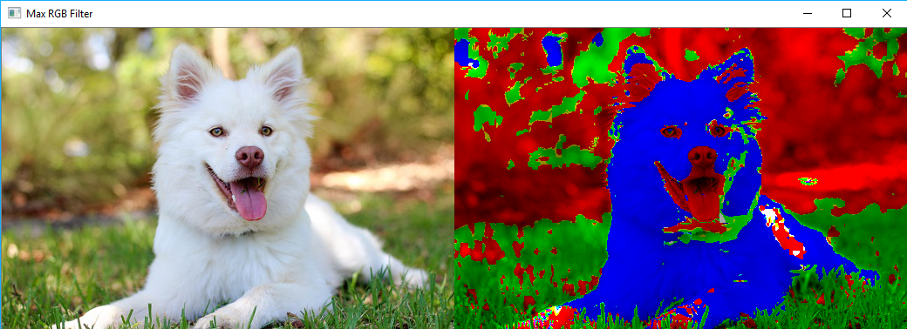

# RGB-Filter

This script compares each RGB pixel value to a max color threshold. We first find the max value of the RGB color at each pixel, then if the value of the pixel for each color channel is less than the threshold, set it to 0. So for each pixel, we can see the dominent color, which overall, shows us which color channel contributes the most to an image.

